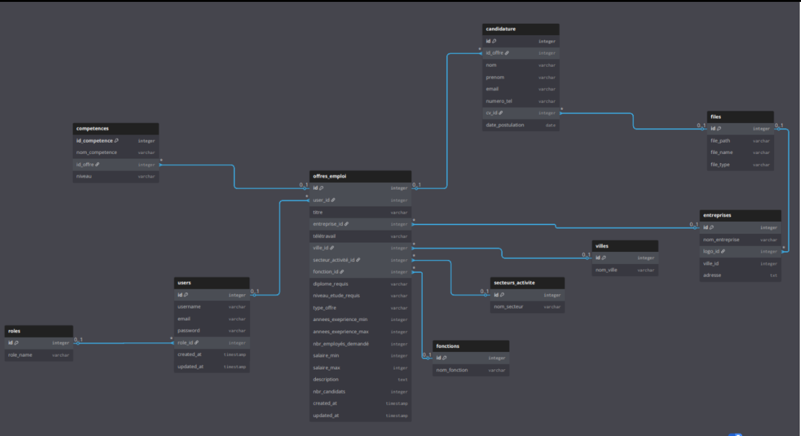
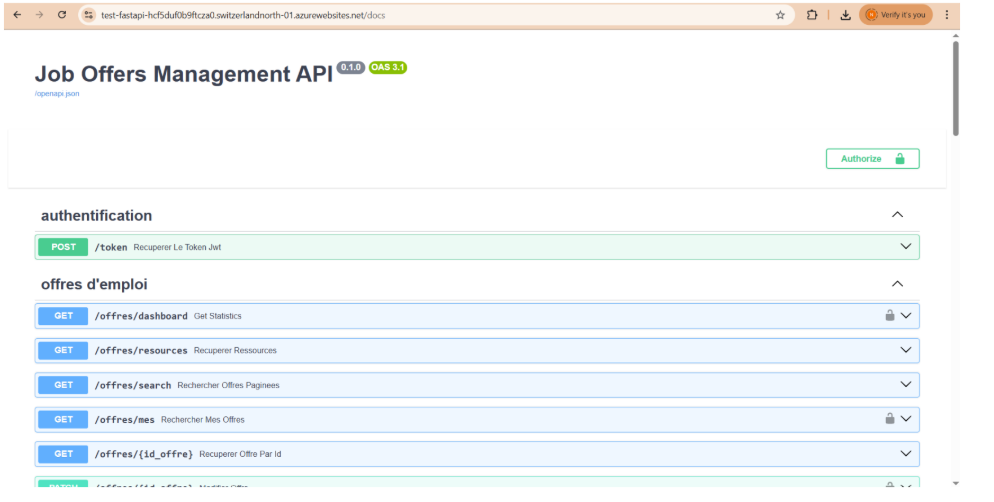

# 🌐 API de Gestion d'Offres d'Emploi

Cette API permet la gestion d'offres d'emploi (CRUD), l'authentification JWT, et fournit une documentation interactive via Swagger UI.

---

## 📦 Fonctionnalités

- Authentification avec JWT (inscription / connexion)
- Création, lecture, mise à jour, suppression d'offres d'emploi
- Gestion des rôles et utilisateurs
- Swagger UI intégré (`/docs`)
- Requêtes sécurisées

---

## MCD



## ⚙️ Installation locale

### 1. 🔁 Cloner le dépôt

``` bash
git clone https://github.com/noureddineFatimi/job-management-api.git
cd job-management-api
```

### 2. 🐍 Créer et activer un environnement virtuel

``` bash
python -m venv venv
venv\Scripts\activate
```

### 3. 📥 Installer les dépendances

``` bash
pip install -r requirements.txt
```

### 3. 🔐 Variables d'environnement

#### Commande pour générer une clé de signature :

``` bash
openssl rand -hex 32
```

#### Créez un fichier `.env` à la racine du projet avec le contenu suivant :

``` python
SECRET_KEY=votre_clé_secrète_de_signature

ALGORITHM=un_algorithme_de_signature_jwt_(ex: HS256)

ACCESS_TOKEN_EXPIRE_MINUTES=une_durrée_d_expiration_en_minutes
```

 ### 4. 🧱 Créer la base de données

``` bash
python app/database/create_database.py
``` 

### 5. 🚀 Lancer le serveur FastAPI

``` bash
uvicorn app.main:app --reload
```


---

## 📚 Documentation interactive

Accédez à l'interface Swagger :   http://127.0.0.1:8000/docs
